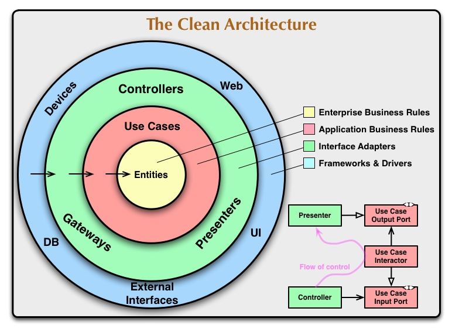

## Clean architecture implementation

This is my implementation of [StackOverflow](https://stackoverflow.com/) using clean architecture principles.

## Core
Contains business logic and entities that are not depend on databases, frameworks and other things that could be postponed.

### Entities
1. User
2. Question
3. Answer
4. Tag

Also there are two entities that are used to manage relations between user and question, and user and answer

5. QuestionUserStats
6. AnswerUserStats

Also repository interfaces were provided with entities.

### Use cases
#### User
- `Get` - get user info
- `Get profile` - get user profile with best `question` and `answer`, total amounts.
- `Update` - update user descriptions

#### Question
- `Create` - create question and attach tags to it
- `Get` - get question with relations and their counts. Also increase views count if user gets question for the first time.
- `Update` - update question
- `Delete` - delete question
- `Get all` - get questions by filter, order and pagination
- `Close` - close or reopen question. If close mark answer as solution
- `Vote` - vote `UP` or `DOWN` for question

#### Answer
- `Create` - create answer of a question
- `Get` - get answer of a question
- `Update` - update answer text
- `Delete` - delete answer
- `Vote` - vote `UP` or `DOWN` for answer

#### Search
There are provided some logic for searching questions and tags, so it was moved to a separate section.

- `Search questions` - search questions by a filter, search string, order, pagination.
- `Search tags` - search tags by name, order, pagination

## Infrastructure
Infrastructure implements repositories, email providers and security utils with certain technologies.

#### Database
The main database is PostgreSQL. It's provided to the project by [PrismaORM](https://www.prisma.io).

Also [Redis](https://redis.io/) was provided for caching.

#### Email
Google email provider was taken to simplify the implementation. 

## Application
In application we provide frameworks, DI mechanisms, connection to databases, controllers and a lot of things.

#### Architecture
Monolit. In fact that could be refactored to any architecture because business logic is independent from it. 
I hope that I implement the project with SOA and microservice architecture soon :)

#### Framework
[Express](https://expressjs.com/). It will be provided by [Nest.js](https://nestjs.com) soon. 

#### Dependency Injection
Dependency injection was provided without any packages. 
I just created instances of every repository, use cases, controller and injected to each other.

---

The architecture implementation was inspired by:
- Uncle Bob's book [Clean Architecture](https://www.amazon.com/Clean-Architecture-Craftsmans-Software-Structure/dp/0134494164)
- [Project](https://github.com/pvarentsov/typescript-clean-architecture/tree/master) of this [guy](https://github.com/pvarentsov)
